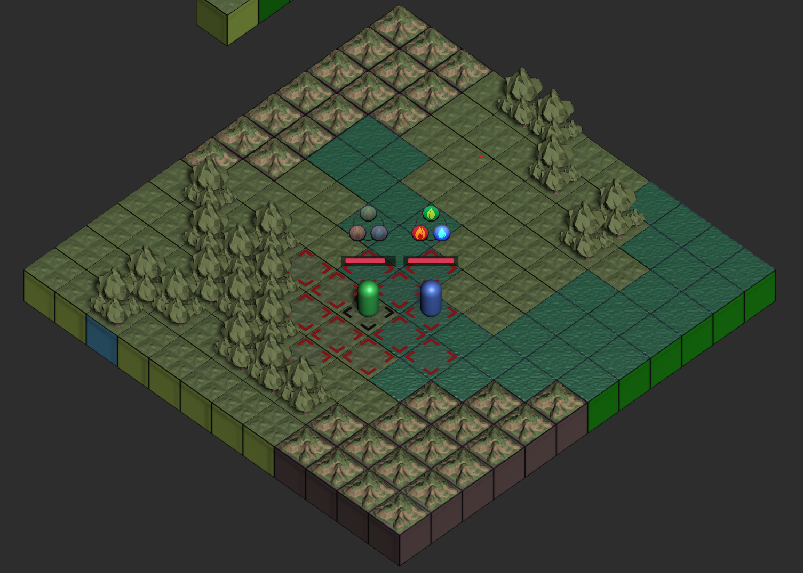

# Counterplay

> Grid-based / turn-based strategy game exploring aspects of system design

## About 
Counterplay is a project for the class, AET 334M (Video Game Systems Design), that demonstrates a unique intersection of primary, secondary, and progression systems. The purpose of the class is to gain a perspective towards video game systems and how they shape an entire game's basis of gameplay via building an implementation over the course of the semester. 

For this particular project, we initially accepted a randomly generated prompt to act as inspiration, which was...

_"A little boy comes to you and presents you with an Egyptian god."_

This was a quite interesting and random prompt, but it lead our team to create a game centered around the concept of elemental states. At first this system was intended to be part of the game's core system group, but through development and discussion it has settled as a secondary system (see in-depth explanation below).

## Demo

The most current build can be found on <a href="https://maxwellmatt.itch.io/counterplay" target="_blank">itch.io</a>.

### Controls

- SPACE - highlights tiles within movement range
- LEFT SHIFT - displays all tiles within attack range
- MOUSE - select tile for either movement or combat

## Systems

### Primary

- Movement
    - The map features a typical grid-based setup composed of tiles, each corresponding to a specific terrain type:
        - Grass
        - Forest
        - Water
        - Mountain
    - Units contain a "movement budget" and can move to tiles whose "movement cost" can be afforded.
    - Movement cost is calculated based on the unit's elemental state and the tile terrain types.
    - Units may only move once per turn and only before they have completed their combat action.

- Combat
    - Units are able to attack units from the opposing team, as long as they are within range.
    - Combat range is computed according to a unit's elemental state and the current tile that that unit is currently assuming.
    - Units can attack before or after they move but can only attack once per turn.
    - The elemental states are balanced as a triangle where each unit has one of the following types of attacks:
        - Strong (i.e. a fire-state unit that attacks a grass-state unit).
        - Normal (i.e. a unit attacking another with the same elemental state).
        - Weak (i.e a grass-state unit attacking a fire-state unit).

### Secondary

- Elemental States
    - The notion of "elemental state" belongs to every unit and influences how that unit interacts with the world and other players.
    - The units within a team do not all have to be assuming the same state.
    - The three elemental states are:
        - Grass
        - Water 
        - Fire

### Progression

- Environmental Manipulation
    - Each unit has the ability to manipulate certain tiles into a secondary form of sorts, which is dependent upon the unit's elemental state. For example:
        - Grass = Lake -> Ice
        - Water = Mountain -> Mountain Pass
        - Fire = Forest -> Ash
    - The changes persist throughout the match and offer interesting strategic gameplay ideas for the players in the later parts of matches.

## Acknowledgements

Thank you to our professor, Tyler Coleman, for teaching an informative and thought-provoking class, especially while having to juggle everything in midst of the COVID-19 pandemic.